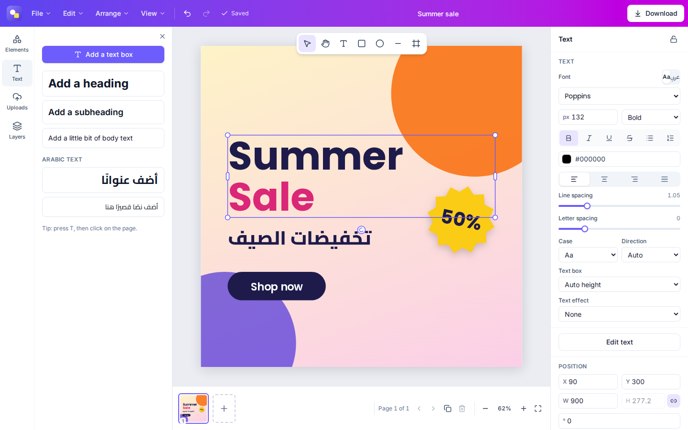
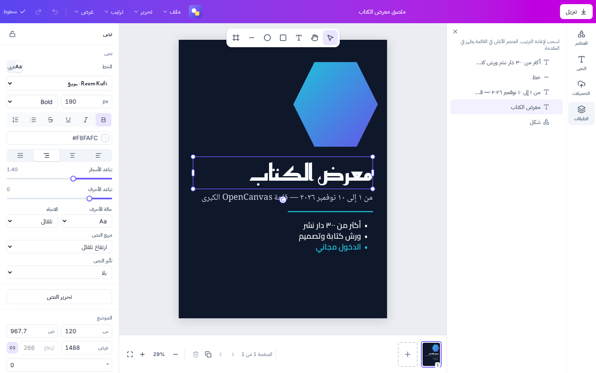
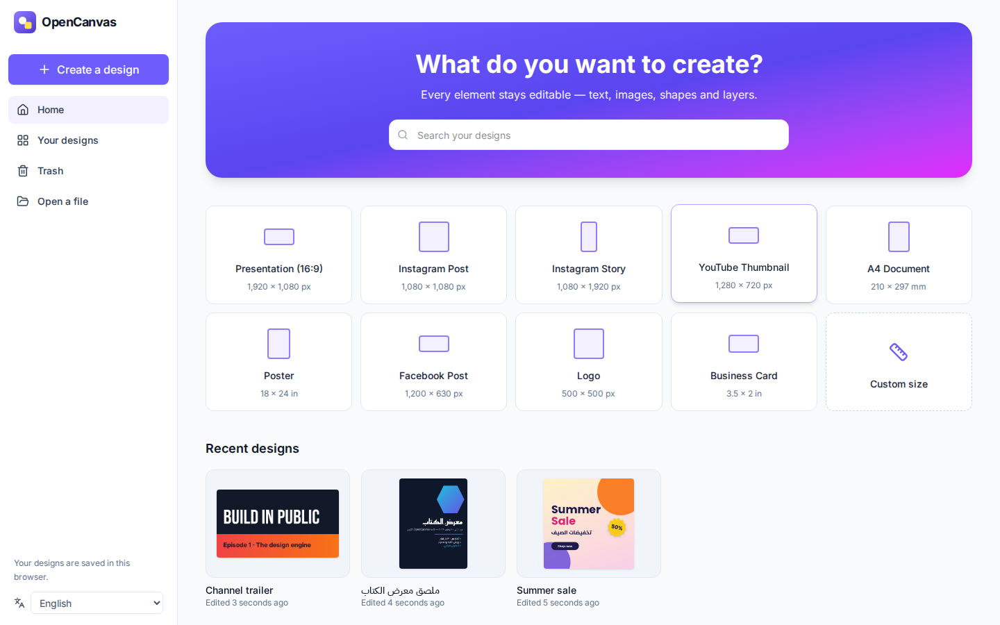

# OpenCanvas

**An open-source visual creation platform built on a real design engine.** Every element stays editable — text, images, shapes, frames and layers — and Arabic is supported properly from day one.

**Website:** [devehab.github.io/OpenCanvas](https://devehab.github.io/OpenCanvas/) (English and Arabic, with recorded demos of every feature)



OpenCanvas is not a template viewer or a UI prototype. Designs are structured documents; every change is a validated, undoable command; the same renderer draws the editor, every export and the server-side tests. That foundation is what later phases — templates, brand kits, video, real-time collaboration and AI that edits designs instead of generating flat images — are built on.

| | |
| --- | --- |
|  |  |

[ملخص بالعربية ↓](#بالعربية)

## Highlights

- **Structured documents, never flattened.** Pages, layers, groups and frames are records in a document model with schemas, limits and canonical serialization ([format](docs/document-format.md)).
- **Command-based editing.** 27 validated commands drive the UI, undo/redo (with gesture batching) and autosave — and can be exported as tool definitions for AI agents.
- **Real Arabic support.** Contextual shaping, Unicode bidi for mixed Arabic/Latin/number text, correct line breaking, Arabic lists and justification, 30 Arabic font families, and a fully mirrored right-to-left interface.
- **Professional editor.** 33 shapes plus polygons, stars and badges, 12 line styles, about 2,900 open-source icons (Lucide and Tabler, searchable in English and Arabic), photo frames you drag photos into (shapes, Polaroids, film strips, collage grids, device mockups), Canva-style crop mode, gradients, strokes, shadows, blur, 16 blend modes, image adjustments, rulers and guides, snapping, alignment, layers, and pages in single, thumbnail, scroll and grid views.
- **Brand kits and projects.** Several brand kits (logos, palettes, fonts, voice, photos, graphics, icons, templates) usable from the editor, and folders for designs and uploads.
- **Your fonts, icons and plugins.** 71 bundled font families (30 Arabic), and you can upload your own fonts (TTF, OTF, WOFF, WOFF2) and SVG icons. Plugins add commands, panels, icon packs and fonts; they run in a sandbox with the permissions you approve ([build a plugin](docs/plugins.md), [دليل تطوير الإضافات](docs/plugins.ar.md)).
- **Start from any file.** Drop an image or a PDF on the dashboard: images become pages of their size, PDF pages become editable pages you can reorder and export again.
- **Local-first and safe.** Designs save to the browser instantly, work offline, survive closing the tab mid-edit, and two tabs can never overwrite each other.
- **Export.** PNG, JPEG and WebP (any scale or DPI, transparent backgrounds, compressed palette PNGs, or a maximum file size), SVG with embedded fonts, PDF and print PDF, any set of pages (hidden pages skipped), multi-page ZIPs, and the editable `.opencanvas` format.
- **Tested like a product.** 439 unit, property and golden-image tests; 96 Playwright tests (including a plugin that tries to escape its sandbox) including visual regression, WCAG 2.1 AA scans, keyboard-only use and frame-rate budgets.

## Quick start

Requirements: Node.js 22+ and pnpm 10 (`corepack enable`).

```bash
pnpm install
pnpm dev                    # http://localhost:3000
```

Production:

```bash
pnpm build && pnpm start    # or:
docker compose up -d --build
```

See [deployment](docs/deployment.md) for Docker, Coolify and Hetzner.

## How it works

```
UI (React) ──dispatch──▶ Commands ──▶ Transactions ──▶ Document store ──▶ Renderer (Canvas2D)
    ▲                    (validated)    (atomic)        (records)          editor · exports · Node
    └──── subscribe ◀── Editor state ◀── History (diffs) ◀──┘
```

React never owns design state; the document model does. Read the [architecture](docs/architecture.md) for the store, history, text engine, rendering, persistence and security model.

| Package | Role |
| --- | --- |
| [`@opencanvas/core`](packages/core) | Document model, schemas, store, commands, history, geometry, text layout, serialization |
| [`@opencanvas/renderer`](packages/renderer) | Canvas2D renderer for the browser and Node (Skia) |
| [`@opencanvas/export`](packages/export) | PNG/JPEG/WebP, SVG, PDF, `.opencanvas` packages, upload validation |
| [`@opencanvas/editor`](packages/editor) | Selection, tools, gestures, snapping, keyboard, clipboard, text editing, canvas view |
| [`@opencanvas/web`](apps/web) | Next.js dashboard and editor, local persistence, English/Arabic UI |

## Testing

```bash
pnpm lint && pnpm typecheck
pnpm test                       # Vitest
pnpm build && pnpm test:e2e     # Playwright
```

Details, including how each item of the spec's test plan maps to a suite: [docs/testing.md](docs/testing.md).

## Roadmap

Phase 1, the editor engine, is complete. Next: the design platform (accounts, server sync, templates, brand kits, fonts, vector PDF), then video, collaboration, AI, the visual suite and the plugin ecosystem. See the [roadmap](docs/roadmap.md) and the full [product specification](docs/product-spec.md).

## Contributing

Contributions are welcome — start with [CONTRIBUTING.md](CONTRIBUTING.md) and the [Definition of Done](docs/definition-of-done.md). Please report security issues privately ([SECURITY.md](SECURITY.md)).

## License

[MIT](LICENSE). The bundled icon library comes from [Lucide](https://lucide.dev) (ISC) and [Tabler Icons](https://tabler.io/icons) (MIT); see [its licenses](apps/web/src/lib/icon-library/LICENSES.md). Regenerate it with `node scripts/generate-icon-library.mjs`.

---

<div dir="rtl" lang="ar">

## بالعربية

‏OpenCanvas منصّة مفتوحة المصدر للتصميم المرئي، مبنيّة على محرّك تصاميم حقيقي: يبقى كل عنصر قابلًا للتعديل — النصوص والصور والأشكال والإطارات والطبقات — ولا يُحفَظ التصميم صورةً مسطّحة أبدًا.

### ما يميّزها

- **تصاميم منظَّمة:** الصفحات والطبقات والمجموعات سجلّاتٌ في نموذج مستندات له مخطّطات وحدود وتسلسل ثابت، لا صور.
- **تحرير قائم على الأوامر:** يمرّ كل تعديل عبر أمر موثّق ومتحقَّق منه، فيعمل التراجع والإعادة والحفظ التلقائي — ولاحقًا التعاون والذكاء الاصطناعي — عبر المسار نفسه.
- **دعم حقيقي للعربية:** وصل الحروف وأشكالها السياقية، والنصوص ثنائية الاتجاه التي تجمع العربية والإنجليزية والأرقام في السطر نفسه، وكسر الأسطر الصحيح، والقوائم والمحاذاة الكاملة للفقرات العربية، وثلاثون عائلةَ خطوط عربية، وواجهة كاملة من اليمين إلى اليسار.
- **حفظ محلي أولًا:** تُحفَظ التصاميم في المتصفح فورًا، وتعمل دون اتصال، ولا تضيع التعديلات عند إغلاق التبويب، ولا يكتب أي تبويب فوق تعديلات تبويب آخر.
- **تصدير متكامل:** ‏PNG وJPEG وWebP بأي دقة ومع خلفية شفافة عند الحاجة، وSVG مع تضمين الخطوط، وPDF وPDF للطباعة، إضافةً إلى ملف ‎.opencanvas‎ الذي يحفظ التصميم كاملًا قابلًا للتعديل.
- **أدوات احترافية:** إطارات صور تسحب إليها الصورة فتأخذ شكلها، وقصّ الصور بنقرة مزدوجة، ومساطر وأدلة، وعرض الصفحات بأربعة أوضاع، ونحو 2900 أيقونة مفتوحة المصدر يمكن البحث فيها بالعربية.
- **الهوية والمشاريع:** حزم هوية متعددة (شعارات وألوان وخطوط وأسلوب وصور وقوالب)، ومجلدات لتنظيم التصاميم والصور.
- **خطوطك وأيقوناتك وإضافاتك:** ارفع خطوطك وأيقونات SVG، وثبّت إضافات تعمل في بيئة معزولة بالصلاحيات التي توافق عليها. لتطوير إضافة اقرأ [دليل تطوير الإضافات](docs/plugins.ar.md).
- **اختبارات صارمة:** أكثر من 430 اختبارًا للوحدات، و96 اختبارًا شاملًا في المتصفح تغطي المقارنة البصرية وإمكانية الوصول والأداء.

### التشغيل

</div>

```bash
pnpm install
pnpm dev                    # http://localhost:3000
docker compose up -d --build   # للنشر
```

<div dir="rtl" lang="ar">

اكتملت المرحلة الأولى (محرّك التصميم)، وتليها منصّة التصميم: الحسابات والمزامنة مع الخادم والقوالب وهويات العلامات التجارية، ثم الفيديو والتعاون والذكاء الاصطناعي. التفاصيل في [خارطة الطريق](docs/roadmap.md) و[مواصفات المنتج](docs/product-spec.md).

</div>
